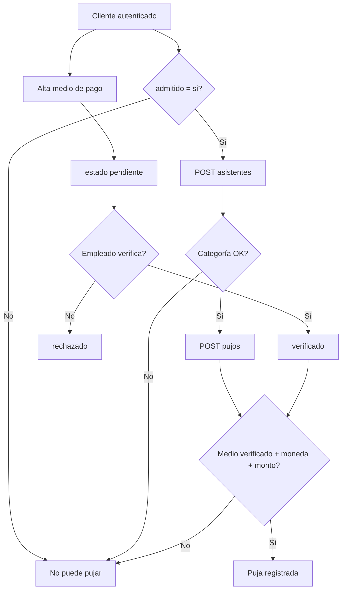

# Payment Methods and Bid Authorization Backend Closure

## 1. Executive summary

**Status: BACKEND_FLOW_CLOSED**

El flujo backend de medios de pago (Fases 1–4) y su documentación de cierre (Fase 5) están completos. La regla de negocio central se cumple en servidor: **sin medio de pago verificado, el cliente puede consultar datos permitidos pero no puede pujar**. `npm run typecheck`, `npm test` (88 tests) y `npm run build` pasan. No hay `npm run lint` en `package.json`.

---

## 2. Scope closed

| Fase | Entregable |
|------|------------|
| **1** | `mediosPago`, `subastas.moneda`, índices únicos `asistentes`, `database/migrations/001_*.sql` |
| **2** | CRUD cliente: list / create (`pendiente`) / disable |
| **3** | Verificación empleado: list / verify / reject |
| **4** | Inscripción asistente + puja con `assertCanBid` y revalidación en transacción |
| **5** | README, OpenAPI, Postman, checklist manual, informe de cierre |

**Fuera de alcance (explícito):** frontend, métricas, pasarelas de pago, consumo de `montoDisponible` en adjudicación, finalización de venta.

---

## 3. Business rule traceability

- **Ver subasta / catálogo:** rutas existentes de subastas/productos no exigen medio verificado.
- **Pujar:** `POST /api/subastas/:id/pujos` exige cadena completa (auth cliente, admitido, asistente, subasta abierta, categoría, medio `verificado` del cliente, moneda compatible, reglas de importe).
- **Doble validación de medio:** `assertCanBid` (fail-fast) + `UPDLOCK` sobre `mediosPago` dentro de la transacción de insert (cierra ventana verify/reject/disable concurrente).

---

## 4. Database traceability

| Artefacto | Rol |
|-----------|-----|
| `dbo.mediosPago` | Garantías del cliente; estados `pendiente` / `verificado` / `rechazado` / `deshabilitado` |
| `dbo.subastas.moneda` | `ARS` \| `USD`; debe coincidir con `mediosPago.moneda` al pujar |
| `UX_asistentes_cliente_subasta` | Un cliente, una inscripción por subasta |
| `UX_asistentes_subasta_numeroPostor` | Número de postor único por subasta |

Migración: `database/migrations/001_medios_pago_subasta_moneda.sql` — ver `database/migrations/README.md`.

---

## 5. Endpoint traceability

Prefijo real: **`/api`**. OpenAPI (`docs/swagger.yaml`) documenta paths sin prefijo; el servidor monta `apiRouter` en `/api`.

### Cliente (`access` + `requireClienteAuth` + contraseña operativa)

| Método | Path | Descripción |
|--------|------|-------------|
| GET | `/api/users/me/payment-methods` | Lista medios propios |
| POST | `/api/users/me/payment-methods` | Alta → `pendiente` |
| PATCH | `/api/users/me/payment-methods/:id/disable` | Deshabilitar propio |
| POST | `/api/subastas/:id/asistentes` | Inscripción postor |
| POST | `/api/subastas/:id/pujos` | Crear puja |

### Empleado (`access` + `role: empleado` + `employeeId`)

| Método | Path | Descripción |
|--------|------|-------------|
| POST | `/api/auth/employee/login` | Token empleado |
| GET | `/api/admin/payment-methods?status=` | Cola revisión (default `pendiente`) |
| PATCH | `/api/admin/payment-methods/:id/verify` | Verificar |
| PATCH | `/api/admin/payment-methods/:id/reject` | Rechazar / revocar |

---

## 6. Error contract

Cuerpo típico: `{ error, message, statusCode, code? }`.

### Auth / cliente

| Código | HTTP | Significado |
|--------|------|-------------|
| `UNAUTHENTICATED` | 401 | Sin token o token inválido |
| `CLIENT_AUTH_REQUIRED` | 403 | Empleado intenta acción de cliente |
| `CLIENT_NOT_FOUND` | 403 | Sin fila en `clientes` |
| `CLIENT_NOT_APPROVED` | 403 | `admitido != si` |
| `FORBIDDEN` | 403 | Empleado en ruta admin sin rol |
| `EMPLOYEE_NOT_FOUND` | 403 | `employeeId` del JWT sin fila |

### Medios de pago

| Código | HTTP |
|--------|------|
| `CVV_NOT_ALLOWED` | 400 |
| `FULL_CARD_NUMBER_NOT_ALLOWED` | 400 |
| `PAYMENT_METHOD_TYPE_INVALID` | 400 |
| `PAYMENT_METHOD_CURRENCY_INVALID` | 400 |
| `PAYMENT_METHOD_FIELD_REQUIRED` | 400 |
| `PAYMENT_METHOD_INVALID_LAST_DIGITS` | 400 |
| `PAYMENT_METHOD_INVALID_AMOUNT` | 400 |
| `PAYMENT_METHOD_REJECTION_REASON_REQUIRED` | 400 |
| `PAYMENT_METHOD_REJECTION_REASON_TOO_LONG` | 400 |
| `PAYMENT_METHOD_NOT_FOUND` | 404 |
| `PAYMENT_METHOD_PENDING_VERIFICATION` | 409 |
| `PAYMENT_METHOD_REJECTED` | 409 |
| `PAYMENT_METHOD_DISABLED` | 409 |
| `PAYMENT_METHOD_NOT_VERIFIED` | 409 |
| `PAYMENT_METHOD_CURRENCY_NOT_ALLOWED` | 409 |
| `PAYMENT_METHOD_INSUFFICIENT_FUNDS` | 409 |
| `PAYMENT_METHOD_STATUS_INVALID` | 409 |

### Subasta / pujas

| Código | HTTP |
|--------|------|
| `AUCTION_NOT_OPEN` | 409 |
| `AUCTION_ATTENDANCE_REQUIRED` | 403 |
| `AUCTION_CAPACITY_FULL` | 409 |
| `CLIENT_CATEGORY_NOT_ALLOWED` | 403 |
| `CLIENT_CATEGORY_INVALID` | 409 |
| `AUCTION_CATEGORY_INVALID` | 409 |
| `ITEM_NOT_FOUND` | 404 |
| `PAYMENT_METHOD_REQUIRED` | 400 |
| `BID_AMOUNT_TOO_LOW` | 409 |
| `BID_AMOUNT_TOO_HIGH` | 409 |
| `BID_CONFLICT` | 409 |
| `BODY_FIELD_NOT_ALLOWED` | 400 |
| `ASSISTANT_REGISTRATION_CONFLICT` | 409 |

`AUCTION_NOT_FOUND` no se expone como código dedicado en pujas: subasta inexistente puede propagarse como error genérico de repositorio; las rutas usan `:id` validado.

---

## 7. Manual testing checklist

Ver [payment-methods-manual-checklist.md](./payment-methods-manual-checklist.md).

---

## 8. Validation commands

| Comando | Resultado |
|---------|-----------|
| `npm run typecheck` (`apps/api`) | OK |
| `npm test` | 88 passed |
| `npm run build` | OK |
| `npm run lint` | No definido |

No hay validador OpenAPI en `package.json`.

---

## 9. Known limitations

- Sin cambios de frontend en esta fase.
- Sin procesador de pagos real (solo metadatos seguros).
- `montoDisponible` de cheque se valida al pujar; **no** se descuenta hasta adjudicación/venta.
- Sin endpoint admin para `clientes.admitido = si` (SQL manual para demo).
- OpenAPI histórico mezcla rutas MVP en inglés con implementación académica en español en bodies de medios de pago; Fase 5 actualizó la sección de medios/pujas/admin.
- Métricas y consumo post-adjudicación: fuera de alcance.

---

## 10. Final recommendation

El backend está **listo para demo y pruebas manuales E2E** con Postman/SQL, siempre que:

1. Migración 001 aplicada.
2. Cliente con `admitido = si` y medio verificado.
3. Subasta abierta con ítem en `itemsCatalogo`.

Siguiente paso natural del producto: integrar el mismo contrato en la app móvil (fuera de este cierre backend).
